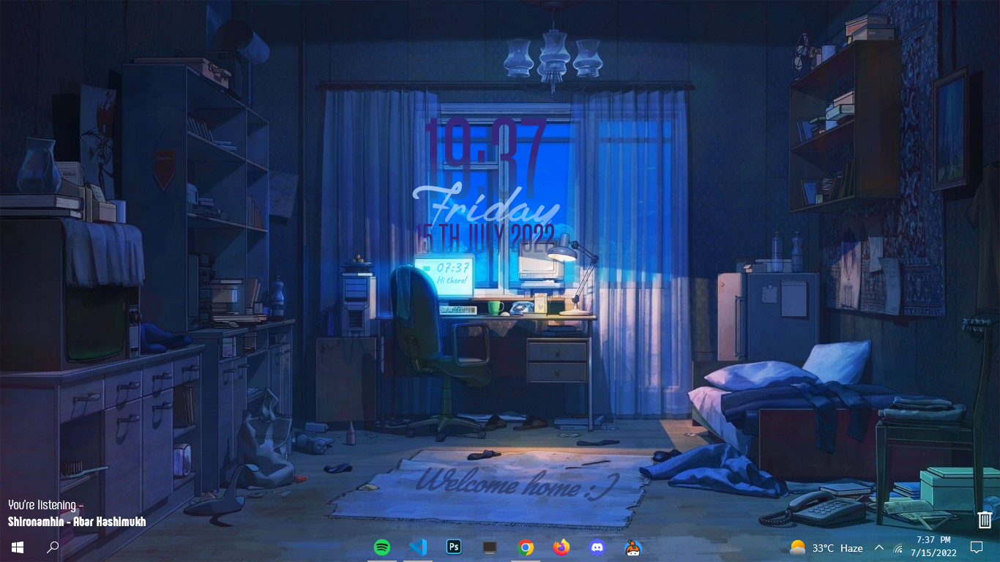

<h2 align="center"> ━━━━━━  ❖  ━━━━━━ </h2>
<!-- BADGES -->

   

   
   
   
   
   

<h2></h2>

## ❖ windots 
<!-- -->

Some config files from my windows10 environment

#### ❖ Included configs for:
- windows terminal preview
- oh-my-posh
- firefox 
- nightab
- rainmeter
- discord web(w/[goosemod](https://goosemod.com/))

#### ❖ Extras:
 ##### Vscode:
 - theme: [vitesse dark](https://marketplace.visualstudio.com/items?itemName=antfu.theme-vitesse)
- File icons: [File icons](https://marketplace.visualstudio.com/items?itemName=file-icons.file-icons)
- product icons: [Carbon](https://marketplace.visualstudio.com/items?itemName=antfu.icons-carbon)

#### ❖ Special thanks to:
- [u/Hyper_Memer](https://www.reddit.com/user/Hyper_Memer/) for [rainmeter config](https://www.reddit.com/r/Rainmeter/comments/vynl2a/comfort_of_the_night/) and [wallpaper](https://i.pinimg.com/originals/f5/04/a9/f504a9e5f31fbc006b4aa217c688512e.jpg)
- [u/yozyk](https://www.reddit.com/user/yozyk/) for nightab [config](https://www.reddit.com/r/nighttab/comments/sjrl8f/here_we_go_again/)

### ❖ Previews:
**Desktop:**

---

**Firefox & Nightab:**

---

**Vscode:**

---
